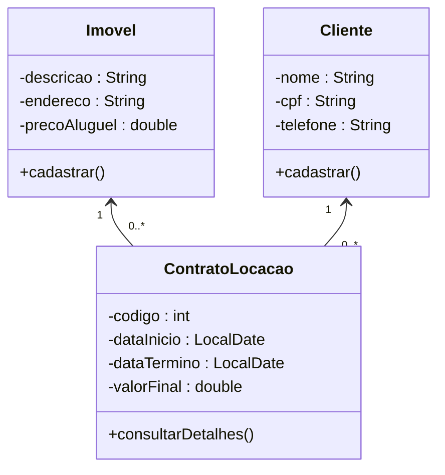

# Diagrama de Classes

```mermaid
classDiagram

class Imovel{
    -descricao : String
    -endereco : String
    -precoAluguel : double
    +cadastrar()
}

class Cliente{
    -nome : String
    -cpf : String
    -telefone : String
    +cadastrar()
}

class ContratoLocacao{
    -codigo : int
    -dataInicio : LocalDate
    -dataTermino : LocalDate
    -valorFinal : double
    +consultarDetalhes()
}

Imovel "1" <-- "0..*" ContratoLocacao
Cliente "1" <-- "0..*" ContratoLocacao
```